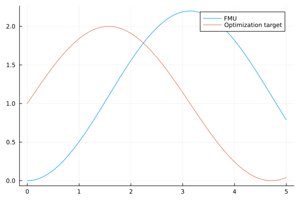
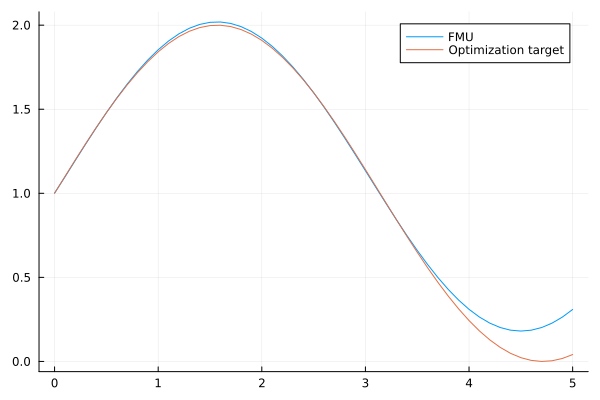

# FMU Parameter Optimization
Tutorial by Tobias Thummerer

## License


```julia
# Copyright (c) 2021 Tobias Thummerer, Lars Mikelsons
# Licensed under the MIT license. 
# See LICENSE (https://github.com/thummeto/FMI.jl/blob/main/LICENSE) file in the project root for details.
```

## Introduction to the example
This example shows how a parameter optimization can be set up for a FMU. The goal is to fit FMU parameters (and initial states), so that a reference trajectory is fit as good as possible.

Note, that this tutorial covers optimization *without* gradient information. Basically, *FMI.jl* supports gradient based optimization, too.

## Other formats
Besides, this [Jupyter Notebook](https://github.com/thummeto/FMI.jl/blob/examples/examples/jupyter-src/parameter_optimization.ipynb) there is also a [Julia file](https://github.com/thummeto/FMI.jl/blob/examples/examples/jupyter-src/parameter_optimization.jl) with the same name, which contains only the code cells and for the documentation there is a [Markdown file](https://github.com/thummeto/FMI.jl/blob/examples/examples/jupyter-src/parameter_optimization.md) corresponding to the notebook.  

## Getting started

### Installation prerequisites
|     | Description                       | Command                   |
|:----|:----------------------------------|:--------------------------|
| 1.  | Enter Package Manager via         | ]                         |
| 2.  | Install FMI via                   | add FMI                   | 
| 3.  | Install FMIZoo via                | add FMIZoo                | 
| 4.  | Install Optim  via                | add Optim                 | 
| 5.  | Install Plots  via                | add Plots                 | 

## Code section

To run the example, the previously installed packages must be included. 


```julia
# imports
using FMI
using FMIZoo
using Optim
using Plots
using DifferentialEquations
```

### Simulation setup

Next, the start time and end time of the simulation are set.


```julia
tStart = 0.0
tStop = 5.0
tStep = 0.1
tSave = tStart:tStep:tStop
```


    0.0:0.1:5.0


### Import FMU

In the next lines of code the FMU model from *FMIZoo.jl* is loaded and the information about the FMU is shown.


```julia
# we use an FMU from the FMIZoo.jl
fmu = loadFMU("SpringPendulum1D", "Dymola", "2022x"; type=:ME)
info(fmu)
```

    #################### Begin information for FMU ####################
    	Model name:			SpringPendulum1D
    	FMI-Version:			2.0
    	GUID:				{fc15d8c4-758b-48e6-b00e-5bf47b8b14e5}
    	Generation tool:		Dymola Version 2022x (64-bit), 2021-10-08
    	Generation time:		2022-05-19T06:54:23Z
    	Var. naming conv.:		structured
    	Event indicators:		0
    	Inputs:				0
    	Outputs:			0
    	States:				2

    
    		33554432 ["mass.s"]
    		33554433 ["mass.v"]
    	Parameters:			7
    		16777216 ["mass_s0"]
    		16777217 ["mass_v0"]
    		16777218 ["fixed.s0"]
    		16777219 ["spring.c"]
    		16777220 ["spring.s_rel0"]
    		16777221 ["mass.m"]
    		16777222 ["mass.L"]
    	Supports Co-Simulation:		true
    		Model identifier:	SpringPendulum1D
    		Get/Set State:		true
    		Serialize State:	true
    		Dir. Derivatives:	true
    		Var. com. steps:	true
    		Input interpol.:	true
    		Max order out. der.:	1
    	Supports Model-Exchange:	true
    		Model identifier:	SpringPendulum1D
    		Get/Set State:		true
    		Serialize State:	true
    		Dir. Derivatives:	true
    ##################### End information for FMU #####################
    

Now, the optimization objective (the function to minimize) needs to be defined. In this case, we just want to do a simulation and compare it to a regular `sin` wave.


```julia
s_tar = 1.0 .+ sin.(tSave)

# a function to simulate the FMU for given parameters
function simulateFMU(p)
    s0, v0, c, m = p # unpack parameters: s0 (start position), v0 (start velocity), c (spring constant) and m (pendulum mass)

    # pack the parameters into a dictionary
    paramDict = Dict{String, Any}()
    paramDict["spring.c"] = c 
    paramDict["mass.m"] = m

    # pack the start state
    x0 = [s0, v0]

    # simulate with given start stae and parameters
    sol = simulate(fmu, (tStart, tStop); x0=x0, parameters=paramDict, saveat=tSave)

    # get state with index 1 (the position) from the solution
    s_res = getState(sol, 1; isIndex=true) 

    return s_res
end

# the optimization objective
function objective(p)
    s_res = simulateFMU(p)

    # return the position error sum between FMU simulation (s_res) and target (s_tar)
    return sum(abs.(s_tar .- s_res))    
end
```


    objective (generic function with 1 method)


Now let's see how far we are away for our guess parameters:


```julia
s0 = 0.0 
v0 = 0.0
c = 1.0
m = 1.0 
p = [s0, v0, c, m]

obj_before = objective(p) # not really good!
```


    54.43232454106065


Let's have a look on the differences:


```julia
s_fmu = simulateFMU(p); # simulate the position

plot(tSave, s_fmu; label="FMU")
plot!(tSave, s_tar; label="Optimization target")
```


    

    


Not that good. So let's do a bit of optimization!


```julia
opt = Optim.optimize(objective, p; iterations=250) # do max. 250 iterations
obj_after = opt.minimum # much better!
p_res = opt.minimizer # the optimized parameters
```


    4-element Vector{Float64}:
     1.001604964840533
     0.9774395626961029
     0.20379335321023856
     0.1774870326495902


Looks promising, let's have a look on the results plot:


```julia
s_fmu = simulateFMU(p_res); # simulate the position

plot(tSave, s_fmu; label="FMU")
plot!(tSave, s_tar; label="Optimization target")
```


    

    


Actually a pretty fit! If you have higher requirements, check out the *Optim.jl* library.


```julia
unloadFMU(fmu)
```

### Summary

This tutorial showed how a parameter (and start value) optimization can be performed on a FMU with a gradient free optimizer. This tutorial will be extended soon to further show how convergence for large parameter spaces can be improoved!
